<h1 align="center">
  
</h1>

Bienvenue sur le dépôt d’infra de [l’Annuaire des Entreprises](https://annuaire-entreprises.data.gouv.fr/).

Ce dépôt héberge le code qui récupère et traite les données publiques françaises d'entreprises à partir desquelles est généré l'index Elastisearch alimentant [l'API Recherche des Entreprises](https://www.data.gouv.fr/dataservices/api-recherche-dentreprises/).

## Objectif du dépôt

L'objectif principal de ce dépôt est de fournir à l'API de Recherche des Entreprises un index Elasticsearch fiable et à jour :

1. **Récupération des données** : Collecte des données publiques françaises d'entreprises à partir de diverses sources (Insee, INPI, Agence Bio, etc.).
2. **Traitement des données** : Nettoyage, transformation et enrichissement des données pour les rendre exploitables.
3. **Indexation des données** : Création d'un index Elasticsearch à partir des données traitées.
4. **Génération de snapshots** : Création de snapshots de l'index Elasticsearch pour alimenter les différentes instances de l'API Recherche des Entreprises.


## Dépôts liés 🏗

Ce dépôt fait partie [d'un ensemble de services qui constituent l'Annuaire des Entreprises](https://github.com/annuaire-entreprises-data-gouv-fr/site?tab=readme-ov-file#dépôts-liés-).


## Sources de données

L'API de recherche expose les données de nombreuses administrations.

Plus d'informations sur les sources de données [par
ici 👉](https://annuaire-entreprises.data.gouv.fr/donnees/sources).

| **Données** | **Administration responsable** | **Accès au jeu de données** |
| ------- | -------------------------- | ----------------------- |
| Données d'identifications des entreprises : dénomination, adresse, code NAF, forme juridique, effectif, etc. | `Insee` | [Fichier source](https://www.data.gouv.fr/datasets/5b7ffc618b4c4169d30727e0/) |
| Informations sur les dirigeants | `INPI` | [FTP INPI](https://data.inpi.fr/content/editorial/Serveur_ftp_entreprises) |
| Liste des professionnels engagés en BIO | `Agence Bio` | [API des professionnels du bio](https://www.data.gouv.fr/dataservices/api-professionnels-bio/) |
| Liste des entreprises RGE | `ADEME` | [Fichier source](https://www.data.gouv.fr/datasets/liste-des-entreprises-rge-1/) |
| Liste des entrepreneurs de spectacles vivants | `Ministère de la Culture` | [Fichier source](https://www.data.gouv.fr/datasets/66fde00a0d497789e7436d9f/) |
| Liste des déclarations Egapro | `Ministère du travail` | [Fichier source](https://www.data.gouv.fr/datasets/61a73dcfe3171089843587bf) |
| Liste des conventions collectives | `Ministère du travail` | Source [des données](https://www.data.gouv.fr/datasets/5e7201d522f2a43e9f736a9a/) et [des métadonnées](https://travail-emploi.gouv.fr/conventions-collectives-nomenclatures) |
| Liste des organismes de formation | `Ministère du travail` | [Fichier source](https://www.data.gouv.fr/datasets/582c8978c751df788ec0bb7e/) |
| Liste des établissements du domaine sanitaire et social (FINESS) | `Ministère des Solidarités et de la Santé` | Fichiers sources des [Finess géographiques](https://www.data.gouv.fr/datasets/finess-extraction-du-fichier-des-etablissements/) et des [Finess juridiques](https://www.data.gouv.fr/datasets/finess-extraction-des-entites-juridiques/) |
| Liste des organismes de formation | - `Ministère de l'Éducation Nationale et de la Jeunesse` <br />-`Ministère de l'Enseignement supérieur et de la Recherche`<br />-`Office national d'information sur les enseignements et les professions` | [Annuaire de l'éducation du MENJ](https://www.data.gouv.fr/datasets/5889d03fa3a72974cbf0d5b1/)<br />[Principaux établissements d'enseignement supérieur du MESR](https://www.data.gouv.fr/datasets/586dae5ea3a7290df6f4be88/)<br />[Idéo-Structures d'enseignement supérieur de l'ONISEP](https://www.data.gouv.fr/datasets/5fa5e386afdaa6152360f323/) |
| Liste des élus d'une collectivité territoriale | `Ministère de l'Intérieur et des Outre-Mer` | [Fichier source](https://www.data.gouv.fr/datasets/repertoire-national-des-elus-1/) |
| Liste des bilans financiers | `INPI`<br />`Équipe Signaux Faibles` | [Jeu de données INPI ratios financiers](https://www.data.gouv.fr/datasets/63cb2e29b22886911440440d/) |
| Liste des collectivités territoriales | `Direction générale des collectivités locales` | [Comptes consolidés des régions](https://www.data.gouv.fr/datasets/5f68c4ec9920494bf28021e3)<br />[Comptes consolidés des départements](https://www.data.gouv.fr/datasets/5f68c4edc9ed7984245b654b)<br />[Liste des EPCI](https://www.collectivites-locales.gouv.fr/etudes-et-statistiques/acces-par-thematique/perimetre-des-intercommunalites/liste-et-composition-des-epci-fiscalite-propre)<br />[Liste des communes](https://www.data.gouv.fr/datasets/630f5173873064dd369479b4) |
| Liste des entreprises de l'Économie Sociale et Solidaire (ESS) | `ESS France` | [Liste des entreprises de l'ESS](https://www.data.gouv.fr/datasets/646c8d45de96cc3428092c6b/) |
| Liste des Structures d'Insertion par l'Activité Economique (SIAE) | `Le marché de l'inclusion` | [API Le marché de l'inclusion](https://lemarche.inclusion.beta.gouv.fr/) |
| Bilan des gaz à effet de serre des entreprises | `ADEME` | [Source des données](https://www.data.gouv.fr/datasets/68c280f8be997b25ea05af20) |
| Liste des labellisés relations fournisseurs et achats responsables  | `Ministère de l'Économie et des Finances` | [Source des données](https://www.data.gouv.fr/datasets/67abe64670ea0b9260c6a4a8) |


## Description des Workflows

Le processus de traitement des données est divisé en plusieurs parties :

1. **Prétraitement** : Ce workflow est responsable de la récupération des données à partir de diverses sources (DataGouv, API, sites web) et de leur stockage dans le service de stockage d'objet.

2. **ETL** : Ce workflow prend en charge la création d'une base de données SQLite à partir des données stockées dans le service de stockage d'objet. Il inclut des étapes d'enrichissement des données.

3. **Indexation** : Ce workflow est responsable de la création de l'index Elasticsearch à partir des données traitées précédemment.

4. **Snapshot** : Ce workflow est déclenché par le workflow Indexation et est responsable de la création de snapshots de l'index Elasticsearch. Ces snapshots sont ensuite utilisés pour alimenter les différentes instances de l'API Recherche des Entreprises.


## Flow des données

```mermaid
flowchart TD
    subgraph Workflow Prétraitement
        subgraph DataGouv["Données sur DataGouv"]
            D1@{ shape: lean-r, label: "Base Sirene (stock)\nsource : INSEE" } -->|DAG Airflow : Quotidien| DB_Object_Storage["Service de Stockage d'Object"]
            D2@{ shape: lean-r, label: "Ratios Financiers\nsource : MINEFI" } -->|DAG Airflow : Quotidien| DB_Object_Storage
            D3@{ shape: lean-r, label: "Elus Collectivités\nTerritoriales\nsource : Ministère \nde l'Intérieur" } -->|DAG Airflow : Quotidien| DB_Object_Storage
            D4@{ shape: lean-r, label: "Conventions Collectives\nsource : Ministère \n du Travail" } -->|DAG Airflow : Quotidien| DB_Object_Storage
            D5@{ shape: lean-r, label: "Déclarations Egapro\nsource : MTPEI" } -->|DAG Airflow : Quotidien| DB_Object_Storage
            D6@{ shape: lean-r, label: "Économie sociale et\nsolidaire\nsource : ESS France" } -->|DAG Airflow : Quotidien| DB_Object_Storage
            D7@{ shape: lean-r, label: "Établissements \nSanitaire et Social\nsource : Ministère \ndes Solidarités\net de la Santé" } -->|DAG Airflow : Quotidien| DB_Object_Storage
            D8@{ shape: lean-r, label: "Entreprises RGE\nsource : ADEME" } -->|DAG Airflow : Quotidien| DB_Object_Storage
            D9@{ shape: lean-r, label: "Entrepreneurs Spectacles\nVivants\nsource : Ministère de \nla Culture" } -->|DAG Airflow : Quotidien| DB_Object_Storage
            D10@{ shape: lean-r, label: "Annuaire de l'éducation\nsource : MENJ & MESR" } -->|DAG Airflow : Quotidien| DB_Object_Storage
        end

        subgraph AutresSources["Autres sources (API, sites)"]
            D11@{ shape: lean-r, label: "Professionnels du BIO\n(API)\nsource : Agence BIO" } -->|DAG Airflow : Quotidien| DB_Object_Storage
            D12@{ shape: lean-r, label: "Organismes de Formation\nsource : DGEFP" } -->|DAG Airflow : Quotidien| DB_Object_Storage
            D13@{ shape: lean-r, label: "Entreprises Inclusives\n(API)\nsource : Marché de \nl'inclusion" } -->|DAG Airflow : Quotidien| DB_Object_Storage
            D14@{ shape: lean-r, label: "Base RNE (stock et API)\nsource : INPI" } -->|DAG Airflow : Quotidien| DB_Object_Storage
            D15@{ shape: lean-r, label: "Base Sirene (API)\nsource : INSEE" } -->|DAG Airflow : Quotidien| DB_Object_Storage
        end
    end

    subgraph Workflow_SQLite["Workflow ETL"]
        DB_Object_Storage@{ shape: lin-cyl, label: "Stockage des\ndonnées sur le service de stockage d'objet" } -->|DAG Airflow: Quotidien| DAG_SQLITE["Création de
        la BDD SQLite"]
        DAG_SQLITE --> SQLite_DB[(SQLite Database)]
        SQLite_DB --> SQLITE_Object_Storage@{ shape: lin-cyl, label: "Stockage DBB\nsur le service de stockage d'objet" }
    end

    subgraph Indexation_Elasticsearch["Workflow Indexation"]
        SQLITE_Object_Storage -->|DAG Airflow : Quotidien
        déclenché par
        le workflow ETL| DAG_Elastic["Chunking & Indexation"]
        DAG_Elastic --> Elastic_DB[(Index Elasticsearch)]
    end

    subgraph Snapshot_Workflow["Workflow Snapshot"]
        Elastic_DB -->|DAG Airflow : Quotidien
        déclenché par
        le workflow Indexation| DAG_Snapshots["Création des Snapshots"]
        DAG_Snapshots --> Snapshot1[(Snapshot 1)]
        DAG_Snapshots --> Snapshot2[(Snapshot 2)]
        DAG_Snapshots --> Snapshot3[(Snapshot 3)]
    end

    Snapshot1 --> API1["API de Recherche
    d'entreprises : instance 1"]
    Snapshot2 --> API2["API de Recherche
    d'entreprises : instance 2"]
    Snapshot3 --> API3["API de Recherche
    d'entreprises : instance 3"]

```



## Tester localement

1. Remplir les variables dans .env
```bash
cat .env.template > .env
nano .env
```
> [!IMPORTANT]
> Les variables commencant par `AIRFLOW_VAR_` sont obligatoires au bon fonctionnement des DAGs.

2. Lancer Airflow et ses dépendances

```bash
docker-compose up --build -d
```

3. Gérer les traitements depuis http://localhost:8080/ (si le port n'a pas été modifié).

4. Tester l'indexation :
```bash
# Les identifiants peuvent être modifiés dans le .env
export ELASTIC_USER=elastic
export ELASTIC_PASSWORD=elastic
# Lister les indices:
curl -u http://localhost:9200/_cat/indices?v
# Vérifier l'état du status:
curl -u http://localhost:9200/_cluster/health?pretty
# Supprimer un index:
curl -u -X DELETE http://localhost:9200/your-index-name
# Voir le mapping d'un index:
curl -u http://localhost:9200/your-index-name/_mapping?pretty
# Lister les aliases:
curl -u http://localhost:9200/_cat/aliases?v
# Chercher tous les documents d'un index:
curl -u http://localhost:9200/your-index-name/_search?pretty
```

> [!NOTE]
> Vous pouvez aussi lancer une instance de l'API de Recherche en local pour faciliter les tests depuis [ce dépôt de code](https://github.com/annuaire-entreprises-data-gouv-fr/search-api).

## Contact

Channel Tchap : `https://tchap.gouv.fr/#/room/#annuaire-entreprises:agent.dinum.tchap.gouv.fr`
