<h1 align="center">
  
</h1>

Bienvenue sur le dépôt d’infra de [l’Annuaire des Entreprises](https://github.com/etalab/annuaire-entreprises-site).

Ce dépôt décrit le workflow qui récupère, traite et indexe les données publiques d'entreprises.

Ce code s'exécute dans une infrastructure Airflow basée sur cette stack 👉 https://github.com/etalab/data-engineering-stack.

## Dépôts liés 🏗

Ce dépôt fait partie [d'un ensemble de services qui constituent l'Annuaire des Entreprises](https://github.com/etalab/annuaire-entreprises-site?tab=readme-ov-file#dépôts-liés-).

## Sources de données

L'API de recherche utilise les données de différentes administrations.

Toutes les données sauf les données des dirigeants sont accessibles sur [data.gouv.fr](https://data.gouv.fr/).

Plus d'informations sur ces sources de données [par
ici 👉](https://annuaire-entreprises.data.gouv.fr/donnees/sources).

| Données                                                          | Administration responsable                                                                                                                                                                                | Accès au jeu de données                                                                                                                                                                                                                                                                                                                                         |
| ---------------------------------------------------------------- | --------------------------------------------------------------------------------------------------------------------------------------------------------------------------------------------------------- | --------------------------------------------------------------------------------------------------------------------------------------------------------------------------------------------------------------------------------------------------------------------------------------------------------------------------------------------------------------- |
| Dénomination, Adresse, Code NAF, Forme juridique...              | `Insee`                                                                                                                                                                                                   | https://www.data.gouv.fr/datasets/base-sirene-des-entreprises-et-de-leurs-etablissements-siren-siret/                                                                                                                                                                                                                                                        |
| Dirigeants                                                       | `INPI`                                                                                                                                                                                                    | [FTP INPI](https://data.inpi.fr/content/editorial/Serveur_ftp_entreprises)                                                                                                                                                                                                                                                                                      |
| Liste des professionnels engagés en BIO                          | `Agence Bio`                                                                                                                                                                                              | https://www.data.gouv.fr/datasets/professionnels-engages-en-bio/                                                                                                                                                                                                                                                                                             |
| Liste des Entreprises RGE                                        | `ADEME`                                                                                                                                                                                                   | https://www.data.gouv.fr/datasets/liste-des-entreprises-rge-1/                                                                                                                                                                                                                                                                                               |
| Liste des entrepreneurs de spectacles vivants                    | `Ministère de la Culture`                                                                                                                                                                                 | https://www.data.gouv.fr/datasets/declarations-des-entrepreneurs-de-spectacles-vivants/                                                                                                                                                                                                                                                                      |
| Liste des déclarations Egapro                                    | `Ministère du travail` | https://www.data.gouv.fr/datasets/index-egalite-professionnelle-f-h-des-entreprises-de-50-salaries-ou-plus |
| Liste conventions collectives                                    | `Ministère du travail`                                                                                                                                                                                    | https://www.data.gouv.fr/datasets/liste-des-conventions-collectives-par-entreprise-siret/                                                                                                                                                                                                                                                                    |
| Liste des organismes de formation                                | `Ministère du travail`                                                                                                                                                                                    | https://www.data.gouv.fr/datasets/liste-publique-des-organismes-de-formation-l-6351-7-1-du-code-du-travail/                                                                                                                                                                                                                                                  |
| Liste des établissements du domaine sanitaire et social (FINESS) | `Ministère des Solidarités et de la Santé`                                                                                                                                                                | https://www.data.gouv.fr/datasets/finess-extraction-du-fichier-des-etablissements/                                                                                                                                                                                                                                                                           |
| Liste des organismes de formation                                | - `Ministère de l'Éducation Nationale et de la Jeunesse`  -`Ministère de l'Enseignement supérieur et de la Recherche` -`Office national d'information sur les enseignements et les professions` | [Annuaire de l'éducation du MENJ](https://www.data.gouv.fr/datasets/5889d03fa3a72974cbf0d5b1/) [Principaux établissements d'enseignement supérieur du MESR](https://www.data.gouv.fr/datasets/586dae5ea3a7290df6f4be88/) [Idéo-Structures d'enseignement supérieur de l'ONISEP](https://www.data.gouv.fr/datasets/5fa5e386afdaa6152360f323/) |
| Liste des élus d'une collectivité territoriale                   | `Ministère de l'Intérieur et des Outre-Mer`                                                                                                                                                               | https://www.data.gouv.fr/datasets/repertoire-national-des-elus-1/                                                                                                                                                                                                                                                                                            |
| Liste des bilans financiers | `INPI` `Équipe Signaux Faibles` | [Jeu de données INPI ratios financiers](https://www.data.gouv.fr/datasets/63cb2e29b22886911440440d/) |
| Liste des collectivités territoriales | `Direction générale des collectivités locales` | [Comptes consolidés des régions](https://www.data.gouv.fr/datasets/5f68c4ec9920494bf28021e3) [Comptes consolidés des départements](https://www.data.gouv.fr/datasets/5f68c4edc9ed7984245b654b) [Table de correspondance Siren et code Insee des communes](https://www.data.gouv.fr/datasets/630f5173873064dd369479b4) |
| Liste des entreprises de l'Économie Sociale et Solidaire (ESS) | `ESS France` | [Liste des entreprises de l'ESS](https://www.data.gouv.fr/datasets/646c8d45de96cc3428092c6b/) | |
| Liste des Structure d'Insertion par l'Activité Economique (SIAE) | `Le marché de l'inclusion` | [API Le marché de l'inclusion](https://lemarche.inclusion.beta.gouv.fr/) | |

## Flow des données

```mermaid
flowchart TD
    subgraph Workflow Prétraitement
        subgraph DataGouv["Données sur DataGouv"]
            D1@{ shape: lean-r, label: "Base Sirene (stock)\nsource : INSEE" } -->|DAG Airflow : Quotidien| DB_MinIO["Base de données MinIO"]
            D2@{ shape: lean-r, label: "Ratios Financiers\nsource : MINEFI" } -->|DAG Airflow : Quotidien| DB_MinIO
            D3@{ shape: lean-r, label: "Elus Collectivités\nTerritoriales\nsource : Ministère \nde l'Intérieur" } -->|DAG Airflow : Quotidien| DB_MinIO
            D4@{ shape: lean-r, label: "Conventions Collectives\nsource : Ministère \n du Travail" } -->|DAG Airflow : Quotidien| DB_MinIO
            D5@{ shape: lean-r, label: "Déclarations Egapro\nsource : MTPEI" } -->|DAG Airflow : Quotidien| DB_MinIO
            D6@{ shape: lean-r, label: "Économie sociale et\nsolidaire\nsource : ESS France" } -->|DAG Airflow : Quotidien| DB_MinIO
            D7@{ shape: lean-r, label: "Établissements \nSanitaire et Social\nsource : Ministère \ndes Solidarités\net de la Santé" } -->|DAG Airflow : Quotidien| DB_MinIO
            D8@{ shape: lean-r, label: "Entreprises RGE\nsource : ADEME" } -->|DAG Airflow : Quotidien| DB_MinIO
            D9@{ shape: lean-r, label: "Entrepreneurs Spectacles\nVivants\nsource : Ministère de \nla Culture" } -->|DAG Airflow : Quotidien| DB_MinIO
            D10@{ shape: lean-r, label: "Annuaire de l'éducation\nsource : MENJ & MESR" } -->|DAG Airflow : Quotidien| DB_MinIO
        end

        subgraph AutresSources["Autres sources (API, sites)"]
            D11@{ shape: lean-r, label: "Professionnels du BIO\n(API)\nsource : Agence BIO" } -->|DAG Airflow : Quotidien| DB_MinIO
            D12@{ shape: lean-r, label: "Organismes de Formation\nsource : DGEFP" } -->|DAG Airflow : Quotidien| DB_MinIO
            D13@{ shape: lean-r, label: "Entreprises Inclusives\n(API)\nsource : Marché de \nl'inclusion" } -->|DAG Airflow : Quotidien| DB_MinIO
            D14@{ shape: lean-r, label: "Base RNE (stock et API)\nsource : INPI" } -->|DAG Airflow : Quotidien| DB_MinIO
            D15@{ shape: lean-r, label: "Base Sirene (API)\nsource : INSEE" } -->|DAG Airflow : Quotidien| DB_MinIO
        end
    end

    subgraph Workflow_SQLite["Workflow ETL"]
        DB_MinIO@{ shape: lin-cyl, label: "Stockage des\ndonnées sur MinIO" } -->|DAG Airflow: Quotidien| DAG_SQLITE["Création de
        la BDD SQLite"]
        DAG_SQLITE --> SQLite_DB[(SQLite Database)]
        SQLite_DB --> SQLITE_MinIO@{ shape: lin-cyl, label: "Stockage DBB\nsur MinIO" }
    end

    subgraph Indexation_Elasticsearch["Workflow Indexation"]
        SQLITE_MinIO -->|DAG Airflow : Quotidien
        déclenché par
        le workflow ETL| DAG_Elastic["Chunking & Indexation"]
        DAG_Elastic --> Elastic_DB[(Index Elasticsearch)]
    end

    subgraph Snapshot_Workflow["Workflow Snapshot"]
        Elastic_DB -->|DAG Airflow : Quotidien
        déclenché par
        le workflow Indexation| DAG_Snapshots["Création des Snapshots"]
        DAG_Snapshots --> Snapshot1[(Snapshot 1)]
        DAG_Snapshots --> Snapshot2[(Snapshot 2)]
        DAG_Snapshots --> Snapshot3[(Snapshot 3)]
    end

    Snapshot1 --> API1["API de Recherche
    d'entreprises : instance 1"]
    Snapshot2 --> API2["API de Recherche
    d'entreprises : instance 2"]
    Snapshot3 --> API3["API de Recherche
    d'entreprises : instance 3"]

```

### Informations

Channel Tchap d'information : `https://matrix.to/#/#annuaire-entreprises:agent.dinum.tchap.gouv.fr`
